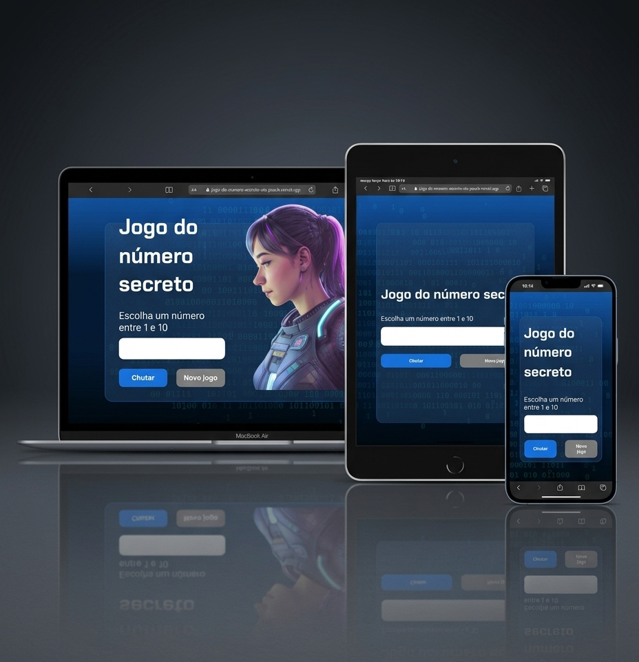

# :1234:Jogo do Número Secreto

<p>O Jogo do Número Secreto é uma aplicação web simples e interativa em que o jogador precisa adivinhar um número gerado aleatoriamente pelo sistema.

A cada tentativa, o jogo fornece dicas indicando se o número digitado é maior ou menor que o número secreto, ajudando o jogador a chegar à resposta correta com o menor número de tentativas possível.

Este projeto foi desenvolvido com foco em praticar:

</p>

<ul>
  <li>Lógica de programação;</li>
  <li>Manipulação do DOM;</li>
  <li>interação com o usuário;</li>
  <li>Responsividade e adaptação em diferentes dispositivos.</li>
</ul>

<p>O projeto foi desenvolvido durante meus estudos em uma formação da Alura.</p>

🔗 Deploy: https://marianaasoares.github.io/jogo-do-numero-secreto/

📁 Repositório: https://github.com/MarianaASoares/jogo-do-numero-secreto


---

# :dart: Objetivo

<p>O objetivo é descobrir o número secreto entre 0 e 10 com o menor número de tentativas possível.
<p></pp>Durante o jogo, o usuário recebe dicas que ajudam a se aproximar da resposta correta.</p>

---

# :rocket: Tecnologias Utilizadas

  

---

# :camera: Preview

   


  
🔗 [Ver projeto](https://conversor-de-moedas-pearl.vercel.app/)

---


# :game_die:Funcionalidades

<p>:heavy_check_mark: Geração automática de um número secreto aleatório ao iniciar o jogo.</p>
<p>:heavy_check_mark: Campo para o usuário inserir seus palpites.</p>
<p>:heavy_check_mark: Feedback informando se o número secreto é maior ou menor que o número digitado.</p>
<p>:heavy_check_mark: Contagem do número de tentativas realizadas.</p>
<p>:heavy_check_mark: Mensagem de sucesso ao acertar o número.</p>
<p>:heavy_check_mark: Botão "Novo Jogo" para reiniciar a partida com um novo número secreto.</p>

---


# :busts_in_silhouette:Acessibilidade

<p>Ao abrir o jogo, o usuário é convidado a ativar uma funcionalidade de narração:</p>
<ul>
  <li>ALLOW: Ativa a narração por voz do jogo.</li>
  <li>DENY: Recusa a narração, permitindo uma experiência silenciosa.</li>
</ul>
<p>Essa funcionalidade torna o jogo mais acessível e inclusivo para todos os tipos de usuários.</p>

---

# :file_folder: Como executar localmente

```bash
git clone https://github.com/MarianaASoares/jogo-do-numero-secreto.git

cd jogo-do-numero-secreto
```

<p>Depois, basta abrir o index.html no navegador.</p>

